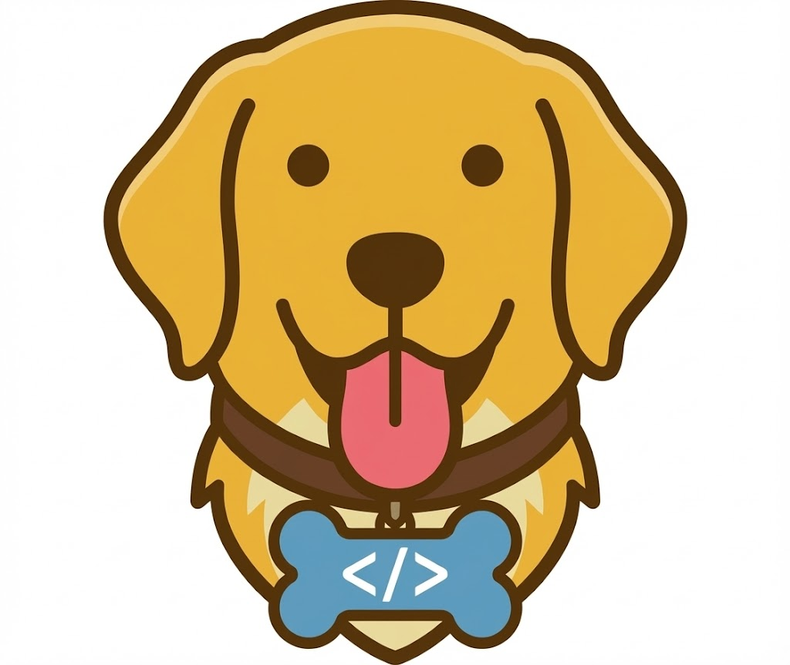
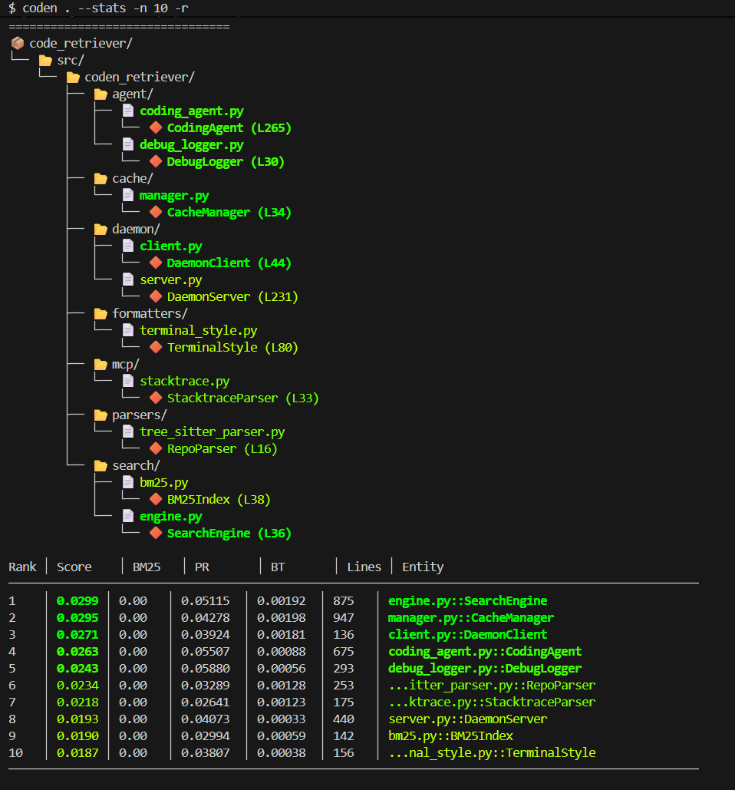
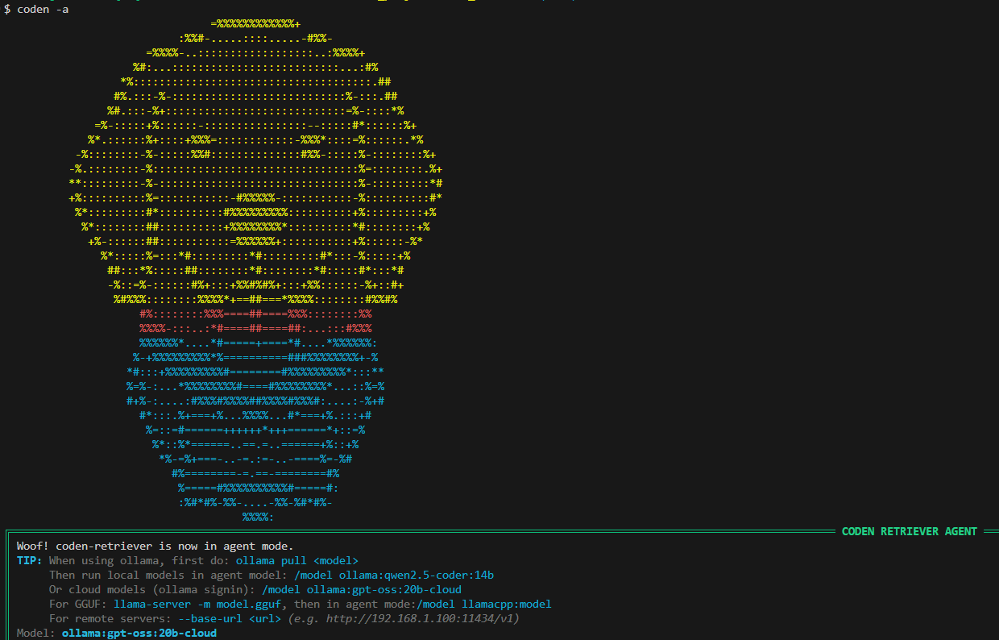

## Install & Run

```bash
pip install coden-retriever
```

**Requires Python 3.10-3.12.** Python 3.13+ is not supported because `tree-sitter-languages` (required for multi-language parsing) only provides wheels up to Python 3.12.

### What's Included

Everything ships in a single install — semantic search, clone detection, echo-comment detection, the MCP server, and the interactive agent are all bundled. The MiniLM ONNX embedding model is packaged inside the wheel, so semantic features work out of the box with no extra download step.

```bash
# Everything (search + analysis + MCP server + agent)
pip install coden-retriever

# Development (tests, linting)
pip install 'coden-retriever[dev]'
```

> **Upgrading from 1.x?** Drop any bracket suffix you were using (`pip install 'coden-retriever[semantic]'`, `[mcp]`, `[agent]`, `[all]`) — `pip install -U coden-retriever` now installs the complete tool.

| Feature | Command Example |
|---------|-----------------|
| BM25 keyword search | `coden /path -q "auth"` |
| Semantic search | `coden /path -q "auth" --semantic` |
| Code map & hotspots | `coden /path --map`, `coden /path -H` |
| Architecture audit | `coden architecture /path` |
| Propagation analysis | `coden /path -P` |
| Dead code detection | `coden /path -D` |
| Tramp data detection | `coden /path -T` |
| Sensitive value detection | `coden /path -S` |
| Magic constant detection | `coden /path -K` |
| Clone detection | `coden /path -C` |
| Echo comment detection | `coden /path -E` |
| MCP server | `coden serve` |
| Interactive agent | `coden --agent` |

```bash
# Get a ranked map of a repo
coden /path/to/repo

# Top 50 results with stats
coden /path/to/repo --stats -n 50 -r

# Search for something
coden /path/to/repo --query "authentication"

# Find a specific symbol
coden /path/to/repo --find "UserAuth"

# Find refactoring hotspots (high coupling + complexity)
coden /path/to/repo --hotspots -n 20 --stats -r

# Detect code clones (find duplicate/similar functions)
coden /path/to/repo --clones --clone-threshold 0.90

# Clone detection modes: semantic-only or syntactic-only
coden /path/to/repo --clones --clone-semantic     # Similar behavior (embeddings)
coden /path/to/repo --clones --clone-syntactic    # Copy-paste detection (Jaccard)

# Analyze architecture health (propagation cost)
coden /path/to/repo --propagation --breakdown

# Find echo comments (comments that just restate the code)
coden /path/to/repo flag -E --dry-run

# Detect dead code (unused functions with no callers)
coden /path/to/repo -D --dead-code-threshold 0.5

# Detect tramp data (parameters appearing in many functions)
coden /path/to/repo -T --min-occurrences 5

# Detect sensitive values (hardcoded secrets, API keys)
coden /path/to/repo -S --sensitive-threshold 0.5

# Detect secrets in source files + text files (.env, .json, etc.)
coden /path/to/repo -S --whitelist "*.env" "*.json"

# Detect magic constants (repeated literal values that should be named)
coden /path/to/repo -K
coden /path/to/repo -K --min-constant-occurrences 5 --min-constant-files 3

# Check whether debugging is available for one language or all adapters
coden debug-availability
coden debug-availability python
coden debug-availability cpp --format json

# Audit architecture: cycles, kitchen-sinks, oversized files, shallow packages, in-function imports
coden architecture /path/to/repo
coden architecture /path/to/repo --top 20        # Custom per-section limit
coden architecture /path/to/repo --exclude tests,vendor  # Skip directories
coden architecture /path/to/repo --lang python   # Force language (python, javascript, typescript, go, rust, java, kotlin, php, c_sharp, scala; auto-detected by default)
coden architecture /path/to/repo --format json   # Output as JSON
```



## The Problem

Codebases are not a flat collection of text files. It is extremely valueable to understand which files are key components and which ones are not. That is what this tool achieves: To help developers, as well as LLM's gain a strong mental model of the codebase.

**Note:** The first run of `$ coden` on a new codebase is slower because it parses everything and builds a call graph. Subsequent runs are cached.

## How It Works

We initially parse code with tree-sitter, build a call graph (functions, classes, methods as nodes; calls, imports, inheritance as edges), and then run two graph algorithms to find what matters:

**PageRank** finds the load-bearing code. If a function is called by many other important functions, it scores high. High PageRank means "if this breaks, a lot of things break."

**Betweenness Centrality** finds the bridges--code that sits between different parts of your system. These are the integration points, the places where module A talks to module B. High betweenness means "this is where different parts of the system meet."

We use these instead of simple text matching because structural dependencies matter. A file that is imported everywhere is more important than a file that happens to contain your search term five times.

### Map Modes

**Default (combined signal)** — Ranks code entities using Reciprocal Rank Fusion across BM25, semantic similarity (optional), PageRank, and betweenness. This is the all-purpose view showing both structural importance and keyword relevance.

**Simple mode (`--map-mode simple`)** — Fast alternative that ranks entities purely by per-file git commit count (with line count as a fallback). Bypasses the daemon and uses a dedicated lite cache on disk so warm runs skip re-parsing:
- Cold run (first parse): ~7 seconds
- Warm run (cached): ~88ms (plus Python startup)

Simple mode is disk-cached automatically; the lite cache coexists with the static cache so you can run both `coden src` and `coden src --map-mode simple` on the same project without cache conflicts. The lite cache is invalidated separately: file changes invalidate the parsed entities; git HEAD changes invalidate only the per-file commit counts while preserving parsed entities across commits.

| What You Are Looking At | PageRank | Betweenness | Example |
|------------------------|----------|-------------|---------|
| Core utility | High | Low | `Logger.log()` - heavily used, does not connect modules |
| Integration point | Medium | High | `APIGateway.route()` - bridges layers |
| Central hub | High | High | `Database.query()` - important AND connects many parts |

Results are ranked using Reciprocal Rank Fusion across:
- **BM25** - Keyword matching
- **Semantic similarity** - Conceptually similar code (enable with `--semantic`)
- **PageRank** - Structural importance
- **Betweenness** - Bridge detection

### Keyword vs Semantic Search vs Simple Ranking

| Mode | When to Use | Requires Daemon |
|------|-------------|-----------------|
| `coden src` (default) | Balanced view: keywords + structure + semantics (optional) | Yes |
| `--query "auth"` | Keyword search for terminology you know | Yes |
| `--query "auth" --semantic` | Natural language questions (e.g., "how does auth work") | Yes |
| `coden src --map-mode simple` | Quick overview ranked by historical edit frequency | No |

**Semantic search** uses an all-MiniLM-L6-v2 ONNX model (INT8 quantized) bundled inside the wheel — no separate download or extra needed.

**Simple mode** (`--map-mode simple`) is designed for speed: it ranks by per-file git commit count, bypasses the daemon entirely, and uses a warm disk cache (~88ms). Ideal for quick architectural overviews or repeated queries on a single codebase where the semantic/structural ranking is less important than turnaround time.

## Supported Languages

**General Search & Analysis:** Python, Go, Rust, Java, C, C++, C#, Kotlin, Javascript/Typescript, PHP, Scala, Bash

**Architecture Audit (`coden architecture`):** ten languages, each plugged in via one adapter under `src/coden_retriever/architecture/adapters/`. Adapters disagree on what a "package" is — the load-bearing concept the five rules audit against — so each one-liner below names that language's package model. Multi-workspace support is built-in for JavaScript, TypeScript, Cargo, Maven, Go, and .NET.

- **Python** — package = any directory containing an `__init__.py`, or a PEP 420 namespace-package directory containing `.py` files.
- **JavaScript** — package = directory with `package.json`, or any `index.{js,mjs,cjs}`-rooted subtree. Workspace: `package.json` `workspaces` field.
- **TypeScript** — same as JavaScript plus `index.{ts,tsx}` / `.d.ts` entries; aliases from `tsconfig.json` `baseUrl` / `paths` are resolved when present. Workspace: `package.json` `workspaces` field.
- **C#** — package = the namespace declared by `.cs` files (`namespace X { … }` block form or `namespace X;` file-scoped form); identity comes from the namespace header, not the directory name. Workspace: `.sln` files with `Project(...)` rows (legacy and SDK GUIDs).
- **Go** — package = directory holding `.go` files; module boundary read from `go.mod`. Workspace: `go.work` with `use` directives.
- **Java** — package = directory under the effective `src/main/java/` root containing `.java` files, named by its POSIX-relative path with `/` → `.`. Workspace: `pom.xml` `<modules>` in multi-module parent.
- **Kotlin** — package = directory whose first `.kt` file declares a `package` header; identity comes from the header (Kotlin permits header / folder mismatch).
- **PHP** — package = directory whose `.php` files declare a `namespace` header (effective root anchored by `composer.json`); `\` separators normalized to `.`.
- **Rust** — package = `mod.rs` / sibling-`.rs` module tree rooted at `src/lib.rs` or `src/main.rs` under a `Cargo.toml`. Workspace: `Cargo.toml` `[workspace] members` field.
- **Scala** — package = directory whose first `.scala` file declares a `package_clause` (top-level `package a.b.c` form or brace-block `package a.b.c { … }` form).

### Workspace Audits

Multi-module / workspace layouts are auto-discovered when a workspace manifest is present at the audit root:

| Ecosystem | Manifest | Discovery |
|-----------|----------|-----------|
| Cargo | `Cargo.toml` `[workspace] members` | Each member's `src/` is audited |
| Maven | `pom.xml` `<modules>` | Each module's `src/main/java/` is audited |
| Go | `go.work` | Each `use` directive points to a module root |
| .NET | `.sln` | Each `Project(...)` row whose path ends in `.csproj` (extension-based; the project-type GUID is ignored — Microsoft emits multiple SDK-style GUIDs across template versions) |
| JavaScript / TypeScript | `package.json` `workspaces` | Each workspace member is audited |

Workspace audits report cross-module call edges and cycles in the unified architecture report. The stat-line gains an optional `· N modules ·` segment when ≥1 module members are walked (e.g., `Rust · 2 modules · 4 packages · 14 files · 0.3k LOC`). Single-module audits emit no segment and are byte-identical to pre-feature output. JSON output gains a `"modules": N` field in the `stats` block (0 for single-module, ≥1 for workspaces).

When a workspace is audited, stderr emits: `architecture audit: N modules walked; K members dropped out-of-root` (informational tripwire).

Not supported by `coden architecture`:

- **C and C++** — both languages have no language-level package construct; a unit of audit (header subtree? `#include` SCC? directory convention?) is a design choice that has not been made. Deferred until a concrete need surfaces.
- **Bash** — bash has no class or package concept, so there is no structural unit for the audit to compare against. (Bash *is* supported by `code_map` and `find_identifier` at function granularity — see the **Bash:** note immediately below.)
- **Gradle** (`settings.gradle.kts` `include(...)`) and **sbt** — multi-project layouts warn and fall back to single-root audit (separate ticket).
- **Maven Polyglot** — custom `<sourceDirectory>`, aggregator `packaging=pom` without sources, and Java 9+ versioned dirs are silently skipped (covered by Maven multi-module, not separately).

**Bash:** Output for bash sources is function-only by design — bash has no class or method concept, so `code_map` and `find_identifier` only surface function definitions and command calls.

## CLI Reference

```bash
coden /path/to/repo                          # Ranked map (combined signal)
coden /path/to/repo --map-mode simple        # Quick map ranked by git commits (warm cache ~88ms)
coden /path/to/repo --query "auth"           # Keyword search
coden /path/to/repo --query "auth" --semantic # Semantic search
coden /path/to/repo --find "UserAuth"        # Find symbol
coden architecture /path/to/repo             # Architecture audit (cycles, kitchen-sinks, oversized files, etc.)
coden /path/to/repo --hotspots -n 20         # Top 20 refactoring hotspots
coden /path/to/repo -H --stats -r            # Hotspots with stats, reversed
coden /path/to/repo -C --clone-threshold 0.90      # Find code clones (90% similarity)
coden /path/to/repo -C --clone-semantic            # Semantic-only clone detection
coden /path/to/repo -C --clone-syntactic           # Syntactic-only clone detection
coden /path/to/repo -C --semantic-weight 0.65      # Adjust combined score weights
coden /path/to/repo -P --breakdown           # Architecture health analysis
coden /path/to/repo -P --critical-paths      # Show high-impact code paths
coden /path/to/repo -D                       # Detect dead code (no callers)
coden /path/to/repo -D --dead-code-threshold 0.7  # Stricter detection
coden /path/to/repo -T                       # Detect tramp data (shared param groups)
coden /path/to/repo -T --min-occurrences 5   # Tramp data with custom threshold
coden /path/to/repo -S                       # Detect sensitive values (secrets, keys)
coden /path/to/repo -S --sensitive-threshold 0.7  # Stricter detection
coden /path/to/repo -S --whitelist "*.env" "*.json" # Scan text files too
coden /path/to/repo -K                       # Detect magic constants (repeated literals)
coden /path/to/repo -K --min-constant-occurrences 5  # Stricter threshold
coden /path/to/repo --map --show-deps        # Show callers/callees
coden /path/to/repo --format json            # Output as json/markdown/xml
coden serve                                  # Start MCP server
coden serve --transport http --port 8000     # MCP over HTTP
coden debug-availability                     # Check debug prerequisites for all adapters
coden debug-availability python              # Check one language
coden debug-availability cpp --format json   # Alias lookup with JSON output
coden -E --remove-comments --dry-run         # Preview echo comment removal
coden -E --remove-comments --backup          # Remove echoes entirely (with backup)
coden flag -C --dry-run                      # Preview clone flags
coden flag -E --dry-run                      # Preview echo comment flagging
coden flag -E --echo-threshold 0.80          # Flag echo comments (default threshold)
coden flag -E --echo-threshold 0.95          # Stricter: only near-identical echoes
coden flag -E --remove-comments --backup     # Alternative: remove via flag subcommand
coden flag -E --include-tests                # Include test files in analysis
coden flag -D --dry-run                      # Preview dead code flagging
coden flag -D --remove-dead-code --backup    # Remove dead code functions (DESTRUCTIVE)
coden flag -S --dry-run                      # Preview sensitive value flags
coden flag -S --whitelist "*.env" --dry-run  # Preview with text file scanning
coden flag -S --replace --backup             # Replace secrets with ***REDACTED***
coden flag -S --replace "HIDDEN" --backup    # Replace with custom placeholder
coden flag -HPCETSK --backup                 # Flag all issues (hotspots, propagation, clones, echoes, tramp data, sensitive values, magic constants)
coden flag clear                             # Remove all [CODEN] comments
coden reset                                  # Reset everything (destructive!)
```

## Daemon Mode

If you are running repeated queries, the daemon keeps indices in memory so you do not pay startup costs every time.

```bash
coden daemon start                # Start background service
coden /path/to/repo -q "auth"     # Queries use daemon automatically
coden daemon status               # Check if running
coden daemon stop                 # Stop it
coden daemon restart              # Restart
coden daemon clear-cache          # Clear daemon cache
coden debug-availability python   # Check if a debugger stack is available locally
```

## Code Flagging

Add `[CODEN]` comments to mark problematic code or remove echo comments/dead code directly:

```bash
coden -E --remove-comments --dry-run # Preview echo comment removal (direct)
coden -E --remove-comments --backup  # Remove echo comments directly
coden flag -C --dry-run              # Preview clone flags
coden flag -E --dry-run              # Preview echo comment flags
coden flag -D --dry-run              # Preview dead code flags
coden flag -T --dry-run              # Preview tramp data flags
coden flag -S --dry-run              # Preview sensitive value flags
coden flag -S --replace --backup     # Replace secrets with ***REDACTED***
coden flag -D --remove-dead-code --backup  # Remove dead code entirely (DESTRUCTIVE)
coden flag -K --dry-run              # Preview magic constant flags
coden flag -HPCETSK --backup         # Flag all analysis types
coden flag clear                     # Remove all [CODEN] comments
```

### Common Options

- **`--dry-run`**: Preview changes without modifying files. Always use this first to see what will be flagged.
- **`--backup`**: Create `.coden-backup` copies of files before modification (e.g., `file.py.coden-backup`).
- **`--include-tests`**: Include test files in analysis (excluded by default).
- **`--stats`**: Display summary statistics after flagging.

### Analysis Types & Thresholds

| Analysis Type | Flag | Threshold Option | Default | Description |
|---|---|---|---|---|
| **Hotspots** | `-H` | `--risk-threshold` | 50 | Min risk score (raw score, typically 50-200+) |
| **Propagation Cost** | `-P` | `--propagation-threshold` | 0.25 | Min internal coupling for modules (0-1) |
| **Code Clones** | `-C` | `--clone-threshold` | 0.95 | Min semantic similarity for clones (0-1) |
| **Echo Comments** | `-E` | `--echo-threshold` | 0.80 | Min similarity for echo detection (0-1) |
| **Dead Code** | `-D` | `--dead-code-threshold` | 0.50 | Min confidence for dead code detection (0-1) |
| **Tramp Data** | `-T` | `--min-occurrences` | 3 | Min functions a param group must appear in (1+) |
| **Sensitive Values** | `-S` | `--sensitive-threshold` | 0.35 | Min confidence for secret detection (0-1) |
| **Magic Constants** | `-K` | `--min-constant-occurrences` / `--min-constant-files` | 3 / 2 | Min times a literal must appear / min distinct files |

**Usage notes:**
- All threshold options work in both direct mode (`coden -H`) and flag mode (`coden flag -H`)
- `-H`: Filters hotspots with `risk_score >= threshold` (raw score = coupling x log(complexity))
- `-P`: Filters modules in breakdown with `internal_coupling >= threshold` (0-1 scale)
- `-C`: Filters clones with `similarity >= threshold` (0-1 scale)
- `-E`: Filters echo comments with `similarity >= threshold` (0-1 scale)
- `-D`: Filters dead code with `confidence >= threshold` (0-1 scale)
- `-T`: Filters tramp data with `function_count >= threshold` (1+ scale, integer)
- `-S`: Filters sensitive values with `confidence >= threshold` (0-1 scale)
- `-K`: Filters literals appearing `>= --min-constant-occurrences` times in `>= --min-constant-files` distinct files

**Threshold ranges:** `-P`, `-C`, `-E`, `-D`, `-S` use 0-1 scale. Lower values are more recall (more results), higher values are more precision (fewer, higher-confidence results). `-H` uses raw risk scores (typically 50-200+). `-K` uses integer counts.

### Code Clone Detection

Clone detection finds duplicate or near-duplicate functions that are candidates for refactoring. Three detection modes are available:

| Mode | Flag | Description | Best For |
|------|------|-------------|----------|
| **Combined** | (default) | Both semantic + syntactic | General use, balanced detection |
| **Semantic** | `--clone-semantic` | MiniLM ONNX embeddings | Behaviorally similar functions |
| **Syntactic** | `--clone-syntactic` | Line-by-line Jaccard | Exact copy-paste detection |

#### Detection Modes Explained

**Combined mode** (default) uses a weighted harmonic mean of semantic and syntactic scores:
- Semantic weight: 0.65 (adjustable via `--semantic-weight`)
- Syntactic weight: 0.35 (adjustable via `--syntactic-weight`)

**Semantic mode** detects functions with similar behavior, even if structurally different. Uses MiniLM ONNX embeddings to find:
- Async/sync variants of the same function
- Functions that do the same thing with different implementations
- Renamed copies with modified variable names

**Syntactic mode** detects copy-paste clones using line-by-line Jaccard similarity:
- `--line-threshold`: Min similarity per line (default: 0.70)
- `--func-threshold`: Min percentage of lines that must match (default: 0.50)

#### Usage Examples

```bash
# Default combined mode (recommended)
coden /path/to/repo -C --clone-threshold 0.90

# Semantic-only: find behaviorally similar functions
coden /path/to/repo -C --clone-semantic

# Syntactic-only: find copy-paste duplicates
coden /path/to/repo -C --clone-syntactic

# Adjust combined weights (more emphasis on semantic similarity)
coden /path/to/repo -C --semantic-weight 0.80 --syntactic-weight 0.20

# Syntactic with custom thresholds
coden /path/to/repo -C --clone-syntactic --line-threshold 0.80 --func-threshold 0.60

# Flag clones in code with [CODEN] comments
coden flag -C --backup
```

### Echo Comment Detection

Echo comments are comments that provide no additional value because they simply repeat what the code identifier already conveys. For example:

**Echo comments (redundant)**:
```python
# Calculate the total
def calculate_total(items):
    return sum(item.price for item in items)

# Process the payment
def process_payment(amount):
    ...
```

**Good comments (provide context)**:
```python
# Apply progressive discount based on customer lifetime value
# Tier 1: 0-10 purchases = 0%, Tier 2: 11-50 = 5%, Tier 3: 51+ = 10%
def calculate_discount_tier(purchases: int) -> float:
    ...
```

Echo detection uses:
- **Tree-sitter AST parsing** to extract ALL comments from your codebase
- **Semantic similarity analysis** (MiniLM ONNX embeddings + cosine similarity) to compare comment text with code identifiers
- **Configurable threshold** to control strictness (0.95 = near-identical only, 0.75 = looser)

#### Usage Examples

```bash
# Preview echo comments (dry run)
coden flag -E --dry-run

# Flag echo comments with [CODEN] markers
coden flag -E --backup

# Remove echo comments entirely (no markers)
coden flag -E --remove-comments --backup

# Adjust threshold (stricter - only exact echoes)
coden flag -E --echo-threshold 0.95 --dry-run

# Adjust threshold (looser - catch more potential echoes)
coden flag -E --echo-threshold 0.75 --dry-run

# Include test files in analysis
coden flag -E --include-tests --dry-run

# Combine with other analysis types
coden flag -HPCETSK --backup  # All analyses at once

# Preview only top 10 issues (limit only works in dry-run mode)
coden flag -H --dry-run -n 10
```

#### Options Explained

**`--dry-run`**: Preview mode - shows what would be changed without modifying any files. Use this first to review results before making changes.

**`-n/--limit`**: Limit the number of results (default: 20). Use `-n -1` to show all results (may be slow for large repos). In flag mode, the limit only applies in dry-run preview - when actually flagging code (without `--dry-run`), all matching items will be flagged to ensure comprehensive coverage.

**`--backup`**: Creates a safety copy of each modified file with a `.coden-backup` extension before making changes. Recommended when removing comments or making bulk modifications. Example: modifying `src/utils.py` creates `src/utils.py.coden-backup`.

**`--remove-comments`**: Deletes detected echo comments entirely from the source files instead of flagging them with `[CODEN]` markers. Works with both `coden -E --remove-comments` and `coden flag -E --remove-comments`. Use with `--backup` for safety. Without this flag, echo comments are only flagged/displayed, not removed.

**`--include-tests`**: Include test files in the analysis (files matching `*test*.py`, `*spec.ts`, etc.). By default, test files are excluded since echo comments are more acceptable in tests where clarity is prioritized over conciseness.

**`--echo-threshold`**: Controls detection strictness (0.0-1.0 range):
- `0.95` = Very strict, only near-identical echoes (e.g., `# get user` -> `get_user()`)
- `0.85` = Stricter, fewer false positives
- `0.80` = Default, balanced detection
- `0.75` = Looser, catches more potential echoes

#### Output Format

Flag mode displays a parameter header showing:
- **Active analysis types** and their thresholds (e.g., "Hotspots (risk >= 50.0)")
- **Preview limit** status (shows if `-n` is limiting results)
- **Warning message** if `-n` is used without `--dry-run`

Detected echo comments show:
- **File path and line number**
- **Similarity score** (0-100%)
- **Severity**: CRITICAL (>95%), HIGH (>90%), ELEVATED (>85%), MODERATE (<85%)
- **Comment text** and **associated code identifier**

### Dead Code Detection

Dead code detection finds functions with no callers in the codebase. Results are scored by confidence (0-1) based on whether the function is private, decorated, or follows entry-point patterns.

#### Usage Examples

```bash
# Basic detection (default 50% confidence threshold)
coden /path/to/repo -D

# Stricter (only high-confidence items)
coden /path/to/repo -D --dead-code-threshold 0.8

# Preview what would be flagged
coden flag -D --dry-run

# Flag with [CODEN] comments
coden flag -D --backup

# Remove dead code entirely (DESTRUCTIVE)
coden flag -D --remove-dead-code --backup
```

#### Options

- **`--dead-code-threshold`**: Minimum confidence (0.0-1.0, default: 0.50)
- **`--include-private`**: Include private functions (default: excluded)
- **`--include-tests`**: Include test functions (default: excluded)
- **`--remove-dead-code`**: Delete functions instead of flagging (use with `--backup`)

Automatically skipped: dunder methods (`__init__`), runtime-called functions (`init()`, `constructor`), test functions, and trivial functions (<3 lines).

### Tramp Data Detection

Tramp data detection identifies parameter groups that travel together across many functions, revealing a common anti-pattern where multiple related parameters are passed individually instead of being bundled into a configuration object.

For example, if you see `(host, port, timeout)` appearing together in 15 different functions, that's tramp data. The ideal refactor would be a `ConnectionConfig` object.

#### What Tramp Data Is

**Anti-pattern (bad)**: Parameters scattered across many functions:
```python
def connect(host, port, timeout):
    ...

def send_data(host, port, timeout, data):
    ...

def receive(host, port, timeout):
    ...

# (host, port, timeout) appears in 15 functions total!
```

**Better**: Grouped into a configuration object:
```python
@dataclass
class ConnectionConfig:
    host: str
    port: int
    timeout: float

def connect(config: ConnectionConfig):
    ...

def send_data(config: ConnectionConfig, data):
    ...

def receive(config: ConnectionConfig):
    ...
```

#### Usage Examples

```bash
# Basic detection (default: groups appearing in 3+ functions)
coden /path/to/repo -T

# Stricter (only groups appearing in 5+ functions)
coden /path/to/repo -T --min-occurrences 5

# Require larger groups (minimum 3 parameters per group)
coden /path/to/repo -T --min-group-size 3

# Limit output to top 30 results
coden /path/to/repo -T -n 30

# Flag tramp data in code with [CODEN] comments
coden flag -T --dry-run
coden flag -T --backup
```

#### Algorithm

Tramp data detection uses:
1. **Frequent pair mining**: Identify which parameter pairs occur together most often across functions
2. **Greedy group expansion**: Merge pairs into larger groups based on co-occurrence patterns
3. **Scoring**: Rank groups by `group_size * function_count` (larger groups appearing in more functions score higher)
4. **Subset suppression**: Avoid duplicate reporting of parameter combinations

#### Options

- **`--min-occurrences`**: Minimum function count for a parameter group (default: 3, range: 1+)
- **`--min-group-size`**: Minimum parameters in a group (default: 2, range: 1+)
- **`-n/--limit`**: Maximum results to display (default: 20, use `-1` for all)

#### Output Format

Tramp data output shows:
- **Parameter Group**: The co-occurring parameters (comma-separated, truncated if >4 params)
- **Functions**: Count of functions containing this group
- **Severity**: Color-coded by frequency (HIGH: 20+, MODERATE: 10-19, LOW: 5-9)
- **Sample Functions**: Up to 3 example functions where the group appears

### Sensitive Value Detection

Sensitive value detection finds hardcoded secrets, API keys, credentials, and other sensitive strings in your codebase using an ML classifier trained on entropy, character patterns, and known secret prefixes.

#### Usage Examples

```bash
# Basic detection (default 35% confidence threshold)
coden /path/to/repo -S

# Stricter (only high-confidence secrets)
coden /path/to/repo -S --sensitive-threshold 0.7

# Scan source code + text files (.env, .json, .yaml, etc.)
coden /path/to/repo -S --whitelist "*.env" "*.json" "*.toml" "*.yaml"

# Preview what would be flagged
coden flag -S --dry-run

# Preview with whitelist scanning
coden flag -S --whitelist "*.env" --dry-run

# Flag with [CODEN] comments
coden flag -S --backup

# Replace secrets with ***REDACTED*** (or custom placeholder)
coden flag -S --replace --backup
coden flag -S --replace "HIDDEN" --backup
```

#### Options

- **`--sensitive-threshold`**: Minimum confidence (0.0-1.0, default: 0.35). Lower = more recall, higher = more precision.
- **`--whitelist`**: Space-separated glob patterns to scan text files for secrets (e.g., `"*.env" "*.json" "*.yaml"`). By default, only source code files (Python, JavaScript, etc.) are scanned. Whitelist adds text file scanning on top. Supported formats: `.env`, `.properties`, `.ini`, `.conf`, `.cfg`, `.json`, `.yaml`, `.yml`, `.toml`.
- **`--replace`**: Replace detected secrets in source code. Without a value, uses `***REDACTED***`. Accepts a custom placeholder.
- **`--include-tests`**: Include test files in analysis (default: excluded).
- **`-n/--limit`**: Maximum results to display (default: 20, use `-1` for all).

## Caching

Indices are cached in `~/.coden-retriever/` with two cache flavors that coexist in the same directory:

**Static cache** (default mode, `coden src`): Comprehensive call graph, BM25 index, embeddings, and graph metrics. Rebuilt when source files change.

**Lite cache** (simple mode, `coden src --map-mode simple`): Parsed entities and per-file git commit counts. Much smaller and faster to load (~88ms warm). Rebuilt when source files change; commit counts refreshed when HEAD changes.

Both caches use disjoint filenames so they don't interfere. For example, a project might have both:
- `manifest.json`, `entities.pkl`, `graph.pkl`, etc. (static cache)
- `lite_manifest.json`, `lite_entities.pkl`, `lite_change_count.pkl` (lite cache)

```bash
coden cache list             # List cached projects
coden cache status           # Cache info for current directory
coden cache status /path     # Cache info for specific project
coden cache clear            # Clear all caches (both flavors) for current directory
coden cache clear /path      # Clear all caches for specific project
coden cache clear --all      # Clear everything
coden cache path             # Show cache directory
```

## Configuration

Settings live in `~/.coden-retriever/settings.json`.

```bash
coden config show        # Show all configuration
coden config path        # Show config file path
coden config reset       # Reset to defaults
coden config set <key> <value>  # Set a value
```

### Configuration Structure

```json
{
  "_version": 1,
  "model": {
    "default": "ollama:gemma4:31b",
    "base_url": null,
    "tool_filter_model": null,
    "provider_urls": {
      "ollama": "http://localhost:11434/v1",
      "llamacpp": "http://localhost:8080/v1"
    },
    "generation": {
      "temperature": 0.7,
      "max_tokens": null,
      "timeout": 30.0,
      "api_key": null
    }
  },
  "agent": {
    "max_steps": 15,
    "max_retries": 5,
    "debug": false,
    "disabled_tools": ["debug_server"],
    "mcp_server_timeout": 30.0,
    "tool_instructions": false,
    "ask_tool_permission": true,
    "dynamic_tool_filtering": false,
    "tool_filter_model": null,
    "tool_filter_threshold": 0.5
  },
  "system_prompt": "You are an expert code intelligence assistant...",
  "daemon": {
    "host": "127.0.0.1",
    "port": 19847,
    "socket_timeout": 30.0,
    "daemon_timeout": 30.0,
    "max_projects": 5
  },
  "search": {
    "default_tokens": 4000,
    "default_limit": 20,
    "semantic_model_path": null
  }
}
```

### Config Values

```bash
# Model
coden config set model.default ollama:gemma4:31b
coden config set model.base_url http://localhost:11434/v1
coden config set model.tool_filter_model openai:gpt-4o
coden config set model.generation.temperature 0.5
coden config set model.generation.max_tokens 4000
coden config set model.generation.api_key sk-...

# System Prompt
coden config set system_prompt "Your custom system prompt here"

# Agent
coden config set agent.max_steps 20
coden config set agent.debug true
coden config set agent.tool_filter_model openai:gpt-4o

# Daemon
coden config set daemon.port 8080
coden config set daemon.max_projects 10

# Search
coden config set search.default_tokens 8000
coden config set search.default_limit 50
coden config set search.semantic_model_path /path/to/custom/onnx_model_dir
```

### Environment Variables

These override the config file:

| Variable | What it does |
|----------|--------------|
| `CODEN_RETRIEVER_MODEL` | Override default model |
| `CODEN_RETRIEVER_BASE_URL` | Override base URL |
| `CODEN_RETRIEVER_DAEMON_PORT` | Override daemon port |
| `CODEN_RETRIEVER_DAEMON_HOST` | Override daemon host |
| `CODEN_RETRIEVER_MODEL_PATH` | Override semantic model path |
| `CODEN_RETRIEVER_MCP_TIMEOUT` | Override MCP server timeout |
| `CODEN_RETRIEVER_ENABLE_DYNAMIC_TOOLS` | Enable dynamic tools (`1`, `true`, `yes`) |
| `CODEN_RETRIEVER_DISABLED_TOOLS` | Comma-separated tools to disable |
| `CODEN_RETRIEVER_TEMPERATURE` | Override model temperature (0.0-2.0) |
| `CODEN_RETRIEVER_MAX_TOKENS` | Override max response tokens |
| `CODEN_RETRIEVER_TIMEOUT` | Override request timeout (seconds) |

## Interactive Agent



Activate coden in agent mode and use an LLM to chat about your codebase.

```bash
coden -a                                                    # Current directory
coden /path/to/repo --agent --model ollama:gemma4:31b     # With Ollama
coden /path/to/repo --agent --model openai:gpt-4o         # With OpenAI API
coden /path/to/repo --agent --model llamacpp:             # With llama-cpp-server
```

**Supported model formats:**

| Format | Example | What it connects to |
|--------|---------|---------------------|
| `ollama:model` | `ollama:gemma4:31b`, `ollama:qwen2.5-coder:14b` | Ollama (localhost:11434) |
| `llamacpp:model` | `llamacpp:my-model` | llama-cpp-server (localhost:8080) |
| `openai:model` | `openai:gpt-4o`, `openai:gpt-4-turbo` | OpenAI API (needs OPENAI_API_KEY) |
| `model` + `--base-url` | `my-model --base-url http://...` | Any OpenAI-compatible endpoint |

For vLLM, LM Studio, etc:
```bash
coden -a --model my-model-name --base-url http://localhost:8000/v1
```

Type `/help` in agent mode to see available commands, `/tools` to enable/disable MCP tools, or `/run` to execute an MCP tool directly and inspect its raw output.

### Slash Commands

| Command | Aliases | What it does |
|---------|---------|--------------|
| `/help` | | Show commands |
| `/model [name]` | `/m` | Show/switch model |
| `/config` | | View/modify settings (interactive picker) |
| `/tools` | `/t` | Enable/disable which MCP tools are exposed to the agent |
| `/run` | `/r`, `/execute` | Execute an MCP tool directly (bypasses the LLM) and inspect its raw result |
| `/study [topic]` | `/learn`, `/quiz` | Quiz mode |
| `/exit-study` | `/stop-study` | Exit quiz |
| `/undo` | | Resume from any prior tool call (branches preserved) |
| `/copy` | `/cp` | Copy last agent response to clipboard |
| `/debug [on\|off]` | `/d` | Toggle debug |
| `/cd [path]` | `/dir`, `/chdir` | Change directory (interactive browser) |
| `/clear` | `/c` | Clear history |
| `/exit` | `/quit`, `/q` | Exit |
| `/cache` | | Cache management |
| `/cache-clear` | `/cc` | Clear current project cache |
| `/cache-list` | `/cl` | List cached projects |

In-agent config:
```
/config                    # Show settings (interactive picker with inline editing)
/config set model ollama:codellama
/config set max_steps 20
/config reset
```

### Agent Features

**Direct Tool Execution** — Run any MCP tool yourself and see the raw output, without the LLM in the loop:
```
/run                       # Opens the tool wizard:
                           #   1. Pick a tool from the numbered menu
                           #   2. Fill in parameters via interactive prompts
                           #   3. Press ENTER to execute
                           #   4. Raw result is printed to the console
                           #   5. Result is also injected into conversation
                           #      history, so you can follow up by asking
                           #      the agent questions about it
```
Useful for testing a tool's behaviour, inspecting exactly what a tool returns, or running a one-off query without spending LLM tokens. The tool is invoked via the MCP server's `direct_call_tool` — no agent context is required.

**Shell Command Execution** — Type `!<command>` to run shell commands:
```bash
!ls -la                    # Run shell command
!npm test                  # Run npm test
!git status                # Check git status
!echo "test" @@ query      # Pipe output to agent (use @@ suffix)
```

**Undo & Branching** — Resume from any prior tool call while preserving branches:
```
/undo                      # Open interactive picker showing all tool calls
                           # Select a tool call to fork a new branch from that point
                           # Select a branch header to switch back to it
                           # Type a steering directive on confirm
```

**Copy Response** — Copy the last agent response to clipboard:
```
/copy                      # Copy latest agent response
```

**Interactive /config Picker** — Edit settings in an intuitive inline editor:
```
/config                    # Shows all settings with inline editing
                           # Use arrow keys to navigate, Enter to edit, Tab to autocomplete
```

## MCP Server

Transport options: `stdio` (default), `http`, `sse`, `streamable-http`

For VS Code, configure `.vscode/mcp.json`:

```json
{
  "servers": {
    "coden": {
      "command": "${workspaceFolder}/.venv/Scripts/python.exe",
      "args": ["${workspaceFolder}/coden.py", "serve"]
    }
  }
}
```

Reload VS Code (Ctrl+Shift+P -> "Developer: Reload Window").

### Tools

**Code Discovery**
- **code_map** - Architectural overview with dependencies. Start here.
- **code_search** - Keyword or semantic search.
- **architecture** - Five-section architecture audit (cycles, kitchen-sinks, oversized files, shallow packages, in-function imports) for Python, JavaScript, TypeScript, Go, Rust, Java, Kotlin, PHP, C#, and Scala projects. CLI: `coden architecture /path`
- **coupling_hotspots** - Find refactoring targets (high coupling + complexity). CLI: `-H`
- **find_hotspots** - Git churn analysis (frequently changed files).
- **clone_detection** - Find duplicate functions (combined/semantic/syntactic modes). CLI: `-C`
- **propagation_cost** - Measure architecture health based on coupling. CLI: `-P`
- **detect_dead_code** - Find unused functions with no callers. CLI: `-D`
- **detect_tramp_data** - Identify parameter groups shared across many functions. CLI: `-T`
- **detect_sensitive_values** - Find hardcoded secrets, API keys, and credentials. CLI: `-S`
- **detect_magic_constants** - Find repeated literal values (magic numbers/strings) that should be named constants. CLI: `-K`

**Graph Analysis**
- **change_impact_radius** - Blast radius analysis ("if I change this, what breaks?").
- **architectural_bottlenecks** - Find bridge functions with high betweenness centrality.

**Symbol Lookup**
- **find_identifier** - Find exact symbol definitions.
- **trace_dependency_path** - "If I change this, what breaks?"

**Code Inspection**
- **read_source_range** - Read specific lines from a file.
- **read_source_ranges** - Read multiple ranges at once.
- **git_history_context** - Git blame info.
- **code_evolution** - How code changed over time.

**File Editing**
- **write_file** - Create or overwrite files.
- **edit_file** - Surgical edits via SEARCH/REPLACE or AST-based SYMBOL targeting.
- **delete_file** - Remove files.
- **undo_file_change** - One-step undo per file.

**Debugging**
- **debug_stacktrace** - Analyze Python stack traces.
- **debug_session** - Manage DAP debug sessions.
- **debug_action** - Step, continue, etc.
- **debug_state** - Inspect variables, evaluate expressions.
- **add_breakpoint** - Inject breakpoints into source.
- **inject_trace** - Add trace/logging statements.
- **remove_injections** - Clean up injected debug code.
- **list_injections** - View active injections.

**Python Environment**
- **check_python_virtual_env** - Detect venvs.
- **get_python_package_path** - Locate installed packages.

**Dynamic Tools** (disabled by default)
- **create_dynamic_tool** - Create custom MCP tools at runtime.
- **remove_dynamic_tool** - Remove dynamic tools.

To enable dynamic tools:
```bash
export CODEN_RETRIEVER_ENABLE_DYNAMIC_TOOLS=1
```

## Docker

All Docker assets (Dockerfile, compose file, `.dockerignore`, and the `coden-docker` wrapper) live under the `docker/` folder. Run the commands below from the repo root.

### Build

```bash
docker build -t coden-retriever:latest -f docker/Dockerfile .
```

### Usage

The `coden-docker` wrapper uses a persistent container:

```bash
cd /path/to/your/project
./docker/coden-docker start .                  # Start container
./docker/coden-docker .                        # Repository map
./docker/coden-docker . --query "auth"         # Search
./docker/coden-docker . --find "MyClass"       # Find symbol
./docker/coden-docker -a                       # Agent mode
./docker/coden-docker stop                     # Stop
```

First run builds the index. After that, the daemon keeps it in memory.

```bash
./docker/coden-docker start [path]   # Start with workspace
./docker/coden-docker stop           # Stop container
./docker/coden-docker restart [path] # Restart with new workspace
./docker/coden-docker status         # Container status
```

### MCP Server in Docker

```bash
docker run -d -p 8000:8000 --name coden-mcp coden-retriever
```

Available at `http://localhost:8000/mcp`, health check at `http://localhost:8000/health`.

### Docker Compose

```bash
docker compose -f docker/docker-compose.yml up -d mcp-server
docker compose -f docker/docker-compose.yml logs -f mcp-server
docker compose -f docker/docker-compose.yml down
```

### Docker Environment Variables

| Variable | Default | What it does |
|----------|---------|--------------|
| `CODEN_RETRIEVER_HOST` | `0.0.0.0` | MCP server bind address |
| `CODEN_RETRIEVER_PORT` | `8000` | MCP server port |
| `CODEN_RETRIEVER_DISABLED_TOOLS` | | Tools to disable |
| `CODEN_RETRIEVER_ENABLE_DYNAMIC_TOOLS` | | Enable dynamic tools |

Health check:
```bash
curl http://localhost:8000/health
# {"status":"healthy","service":"CodenRetriever"}
```

### Agent Mode with Ollama in Docker

The container connects to host Ollama via `host.docker.internal`:

```bash
# On host
ollama serve

# In Docker
./docker/coden-docker -a
# Then: /model ollama:qwen2.5-coder
```

## Debug Availability

The `coden debug-availability` command checks whether debugging prerequisites are met for each supported language.

```bash
coden debug-availability                     # Check all adapters
coden debug-availability python              # Check one language
coden debug-availability cpp --format json   # JSON output
```

The text output uses icons and colors to make status easy to scan:

- **`✓ language: available`** — All prerequisites met (shown in green)
- **`✗ language: unavailable — reason`** — Missing prerequisites with inline explanation (shown in red)
- Each dependency line shows whether it is installed (`✓`) or missing (`✗`)
- Install hints are shown in cyan when a dependency is missing

Use `--format json` for machine-readable output.

## Troubleshooting

If you encounter problems, clearing the cache and stopping the daemon might help:

```bash
coden cache clear --all
coden daemon stop
```

### Full Reset

To reset everything at once, use the reset command:

```bash
coden reset
```

This performs all of the following in one step:
- Clears all project caches
- Stops the daemon
- Resets configuration to defaults

> **Warning:** This is a destructive operation. Your custom configuration settings will be lost and all cached indices will be deleted.

### Ollama context window too small

Ollama defaults to a 4096-token context, which is too small for agent mode — the system prompt plus tool schemas alone exceed it, and you'll see truncated or nonsensical responses. Raise the default by setting `OLLAMA_CONTEXT_LENGTH=64000` before starting Ollama:

- **Windows:** `setx OLLAMA_CONTEXT_LENGTH 64000`, then restart the Ollama tray app.
- **macOS / Linux:** `export OLLAMA_CONTEXT_LENGTH=64000` before `ollama serve`.

Verify with `ollama ps` — the `CONTEXT` column should show `64000` once a model is loaded. Some models pin `num_ctx` in their Modelfile and override this; in that case create a custom Modelfile with `PARAMETER num_ctx 64000`.
